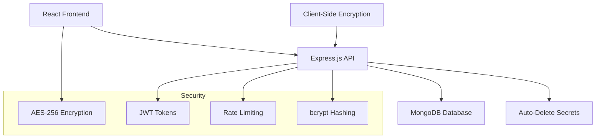

# Secrify
A secure, full-stack web application that enables users to share sensitive information via encrypted, self-destructing links. Built with modern technologies focusing on security, user privacy, and seamless user experience.
# 🔐 One-Time Secret

A secure, full-stack web application for sharing sensitive information via encrypted, self-destructing links. Your secrets are protected with military-grade encryption and automatically destroyed after viewing.


## ✨ Features

### 🔒 Security First
- **End-to-End AES-256-GCM Encryption** - Messages encrypted before leaving your browser
- **One-Time Access** - Links automatically invalidate after specified views
- **Zero-Knowledge Architecture** - We never see your unencrypted data
- **Automatic Expiration** - Secrets self-destruct from 1 hour to 7 days
- **Password Protection** - Optional additional security layer
- **JWT Authentication** - Secure token-based access control

### 🎨 Modern UX
- **Responsive Design** - Works perfectly on desktop, tablet, and mobile
- **Real-time Validation** - Instant feedback and error handling
- **Copy-to-Clipboard** - Easy sharing with one click
- **Beautiful UI** - Modern, minimalist design with smooth animations
- **No Registration** - Completely anonymous and private

### 🚀 Performance
- **Fast API Responses** - Optimized database queries and caching
- **Efficient Bundling** - Vite-powered frontend for lightning-fast loads
- **Production Ready** - Robust error handling and monitoring

## 🏗️ Architecture



## 🛠️ Tech Stack

### Frontend
- **React 18** with TypeScript
- **Tailwind CSS** for styling
- **React Router** for navigation
- **Axios** for API calls
- **Lucide React** for icons
- **Vite** for build tooling

### Backend
- **Node.js** with Express.js
- **TypeScript** for type safety
- **MongoDB** with Mongoose ODM
- **JWT** for authentication
- **bcryptjs** for password hashing
- **Crypto** for encryption
- **Helmet.js** for security headers

## 🚀 Quick Start

### Prerequisites
- Node.js 16+ 
- MongoDB (local or Atlas)
- npm or yarn

### Installation

1. **Clone the repository**
```bash
git clone https://github.com/yourusername/one-time-secret.git
cd one-time-secret
```

2. **Setup Backend**
```bash
cd backend
npm install

# Create environment file
cp .env.example .env
# Edit .env with your configurations
```

3. **Setup Frontend**
```bash
cd ../frontend
npm install
```

4. **Configure Environment**
```env
# Backend .env
PORT=5000
MONGODB_URI=mongodb://localhost:27017/one-time-secret
JWT_SECRET=your-super-secret-jwt-key
ENCRYPTION_KEY=your-32-character-encryption-key
NODE_ENV=development
```

5. **Run the Application**
```bash
# Terminal 1 - Backend
cd backend
npm run dev

# Terminal 2 - Frontend  
cd frontend
npm run dev
```

Visit `http://localhost:3000` to see the application!

## 📁 Project Structure

```
one-time-secret/
├── backend/
│   ├── src/
│   │   ├── controllers/     # Route controllers
│   │   ├── models/          # MongoDB models
│   │   ├── routes/          # API routes
│   │   ├── middleware/      # Auth, validation, etc.
│   │   ├── utils/           # Encryption, token generation
│   │   └── config/          # Database, environment config
│   └── package.json
├── frontend/
│   ├── src/
│   │   ├── components/      # React components
│   │   ├── hooks/           # Custom React hooks
│   │   ├── services/        # API services
│   │   ├── types/           # TypeScript definitions
│   │   └── utils/           # Helper functions
│   └── package.json
└── README.md
```

## 🔧 API Endpoints

| Method | Endpoint | Description |
|--------|----------|-------------|
| `POST` | `/api/secrets/create` | Create a new secret |
| `POST` | `/api/secrets/view/:id` | Retrieve a secret (requires token) |
| `GET` | `/api/secrets/validate/:id` | Check if secret exists |
| `GET` | `/api/secrets/stats` | Get application statistics |
| `GET` | `/health` | Health check |

### Example Usage

**Create a Secret:**
```bash
curl -X POST http://localhost:5000/api/secrets/create \
  -H "Content-Type: application/json" \
  -d '{
    "message": "My secret password",
    "password": "optional-pass",
    "expiresIn": "24",
    "maxViews": 1
  }'
```

**Response:**
```json
{
  "success": true,
  "secretId": "a1b2c3d4e5f6...",
  "accessToken": "jwt.token.here",
  "expiresAt": "2024-01-01T12:00:00.000Z",
  "url": "http://localhost:3000/view/a1b2c3d4e5f6..."
}
```

## 🛡️ Security Implementation

### Encryption Flow
1. **Client-Side Encryption**: Message encrypted with AES-256-GCM before sending to server
2. **Secure Storage**: Only encrypted message and IV stored in database
3. **Token-Based Access**: JWT tokens required for decryption
4. **Auto-Destruction**: Secrets automatically deleted after viewing or expiration

### Security Features
- ✅ AES-256-GCM encryption
- ✅ JWT token authentication
- ✅ bcrypt password hashing
- ✅ Rate limiting (100 requests/15min)
- ✅ CORS protection
- ✅ Helmet.js security headers
- ✅ Input validation and sanitization
- ✅ MongoDB injection prevention

## 🎯 Usage Examples

### Share Passwords Securely
```typescript
// Create a password secret that expires in 1 hour
const secret = {
  message: "MyDatabasePassword123!",
  expiresIn: "1",
  maxViews: 1,
  password: "optional-recipient-password"
};
```

### Send Private Notes
```typescript
// Share confidential information with team
const secret = {
  message: "Q4 financial projections...",
  expiresIn: "168", // 7 days
  maxViews: 5, // Allow team access
  password: "team-secret-2024"
};
```

## 🚀 Deployment

### Backend Deployment (Railway/Heroku)
```bash
# Set environment variables
NODE_ENV=production
MONGODB_URI=your_mongodb_atlas_uri
JWT_SECRET=your_production_jwt_secret
ENCRYPTION_KEY=your_32_char_encryption_key
```

### Frontend Deployment (Vercel/Netlify)
```bash
# Build command
npm run build

# Output directory
dist/
```

## 🤝 Contributing

We love contributions! Here's how to help:

1. **Fork** the repository
2. **Create** a feature branch (`git checkout -b feature/amazing-feature`)
3. **Commit** your changes (`git commit -m 'Add amazing feature'`)
4. **Push** to the branch (`git push origin feature/amazing-feature`)
5. **Open** a Pull Request

### Development Setup
```bash
# Install dependencies
npm install

# Run in development mode
npm run dev

# Run tests
npm test

# Build for production
npm run build
```

## 🐛 Troubleshooting

### Common Issues

**MongoDB Connection Error**
```bash
# Make sure MongoDB is running
mongod

# Or use MongoDB Atlas cloud service
```

**Encryption Key Issues**
```bash
# Ensure ENCRYPTION_KEY is exactly 32 characters
ENCRYPTION_KEY=this-is-32-char-encryption-key!!
```

**Port Already in Use**
```bash
# Change ports in .env files
PORT=5001  # Backend
PORT=3001  # Frontend
```

## 📊 Performance Metrics

- **API Response Time**: < 100ms
- **Frontend Load Time**: < 2s
- **Database Queries**: Optimized with proper indexing
- **Bundle Size**: < 500KB (gzipped)

## 🔮 Roadmap

- [ ] **Browser Extension** for quick secret sharing
- [ ] **File Upload Support** for encrypted file sharing
- [ ] **Two-Factor Authentication** for additional security
- [ ] **API Rate Limiting Dashboard**
- [ ] **Mobile App** (React Native)
- [ ] **Admin Panel** for usage analytics
- [ ] **WebSocket Support** for real-time updates

## 📄 License

This project is licensed under the MIT License - see the [LICENSE](LICENSE) file for details.

## 🙏 Acknowledgments

- **React Team** for the amazing framework
- **Tailwind CSS** for the utility-first CSS framework
- **MongoDB** for the reliable database solution
- **Vite** for the fast build tooling

## 📞 Support

If you have any questions or need help, please:

1. Check the [Troubleshooting](#troubleshooting) section
2. Open an [Issue](https://github.com/yourusername/one-time-secret/issues)
3. Contact the maintainers

---

<div align="center">

**Built with ❤️ and 🔐 security in mind**

[Report Bug](https://github.com/yourusername/one-time-secret/issues) · [Request Feature](https://github.com/yourusername/one-time-secret/issues) · [⭐ Star on GitHub](https://github.com/yourusername/one-time-secret)

</div>
